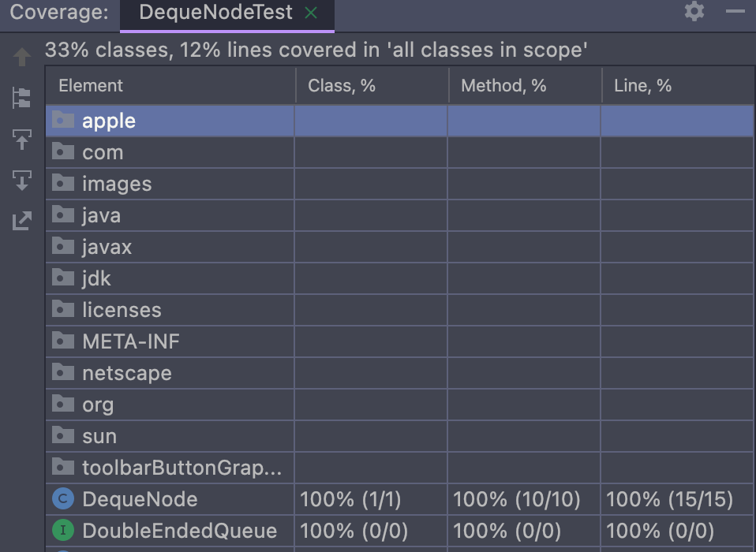
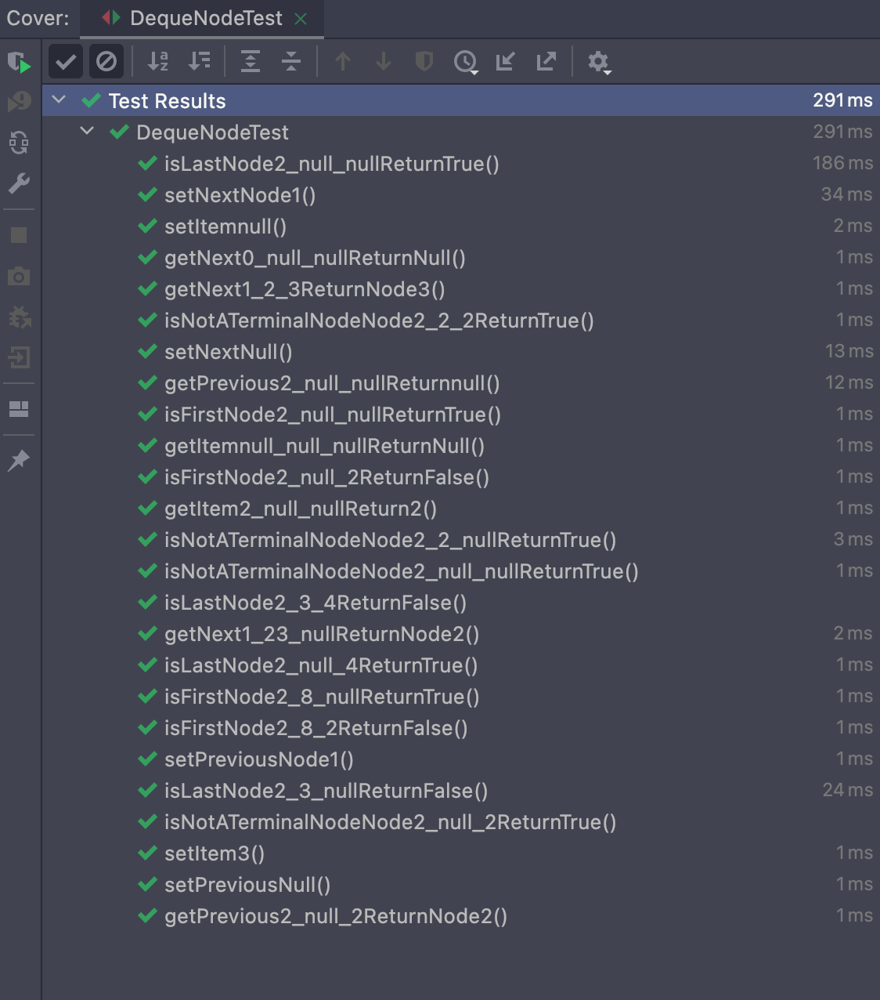
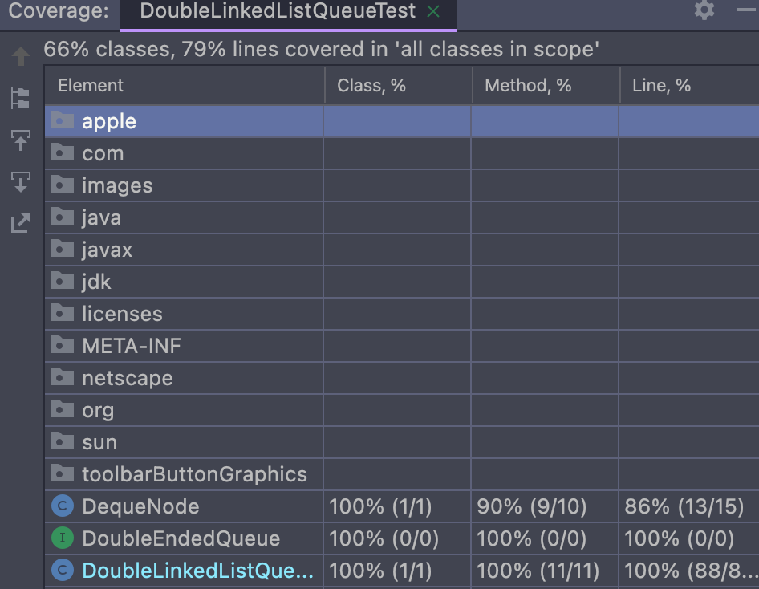
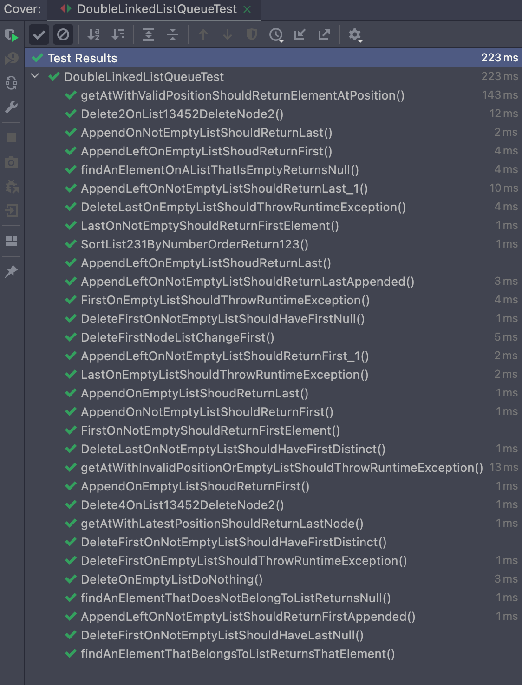

# Tests de código DequeNode


# Cobertura de código DoubleLinkedListQueue


# Tests de código DoubleLinkedListQueue

>>>>>>> Stashed changes


# Fichero testCases
```plaintext
NODEQUEUE
setItem(3) establece a 3 item
setItem(null) establece a null item

setPrevious(Node(2,null,null)) establece el anterior a Node(2,null,null)
setPrevious(null) establece el anterior a null

setNext(Node(2,null,null)) establece el siguiente a Node(2,null,null)
setNext(null) establece el siguiente a null

isNotATerminalNode() para (2,2,2) es verdadero
isNotATerminalNode() para (2,null,2) es falso
isNotATerminalNode() para (2,2,null) es falso
isNotATerminalNode() para (2,null,null) es falso

isFirstNode() para (2, 8, null) es verdadero
isFirstNode() para (2, 8, 2) es falso
isFirstNode() para (2, null, null) es verdadero
isFirstNode() para (2, null, 2) es falso

isLastNode() para (2,null,null) es verdadero
isLastNode() para (2,3,null) es falso
isLastNode() para (2,3,4) es falso
isLastNode() para (2,null,4) es verdadero

getItem() para (null,null,null) devuelve null
getItem() para (2,null,null) devuelve 2

getNext() para (1, 2, 3) devuelve nodo2
getNext() para (1, 23, null) devuelve nodo23
getNext() para (0, null, null) devuelve null

getPrevious() para (2,2,null) devuelve null
getPrevious() para (2,null,3) devuelve 3

DOUBLE LINKED LIST QUEUE
Suponiendo que  - nodo = new Node(1,null,null)
                - lista = new DoubleLinkedListQueue<>() (lista vacía)

sort(2-->3-->1) devuelve la lista (1-->2-->3)
delete(nodo(2)) en la lista (1-->3-->4-->5-->2) devuelve la lista (1-->3-->4-->5)
delete(nodo(4)) en la lista (1-->3-->4-->5-->2) devuelve la lista (1-->3-->5-->2)
delete de lista vacia no hace nada
delete el primer nodo cambia el nuevo primer nodo
append(nodo) en lista, lista.first será nodo
append(nodo) en lista, lista.last será nodo
append(nodo) , append(nodo1) en lista ,lista.first será nodo1
append(nodo), append(nodo1) en lista, lista.last será nodo
appendLeft(nodo) en lista, lista.first será nodo
appendLeft(nodo) en lista, lista.last será nodo
appendLeft(nodo), appendLeft(nodo1) en lista, lista.first será nodo
appendLeft(nodo), appendLeft(nodo1) en lista, lista.last será nodo1
lista.deleteFirst() elevará una RuntimeException
lista.deleteLast() elevará una RuntimeException
append(nodo) en lista, lista.deleteFirst() dejará la lista vacía, first = null y last = null
lista.peekFirst() elevará una RuntimeException
lista.peekLast() elevará una RuntimeException
lista.append(nodo) en lista, lista.peekFirst() será lista.first
lista.append(nodo) en lista, lista.peekLast() será lista.last
append(nodo1), append(nodo2), append(nodo3) en lista, lista.getAt(2) dará el nodo1
lista.getAt(-1) elevará una RuntimeException
Rellenando la lista con 9 nodos, lista.getAt(9) será igual a lista.last
Rellenando la lista con 9 nodos, list.find(9) será igual a lista.last
Rellenando la lista con 9 nodos, hacer list.find(45) devolverá NULL.
En una lista vacía, hacer list.find(1) devolverá NULL.
```


# Autores
Nicolás Alvárez Romero <br>
José Luis Bueno Pachón

